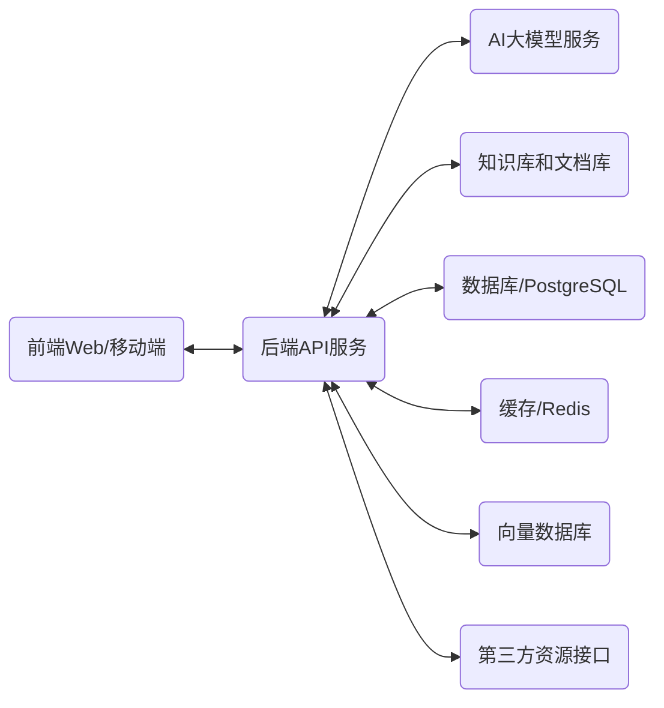

# 制作AI辅助学习网站计划

### 🧑‍💻 User

我想做一个类似 https://www.studywithgpt.com 和 https://roadmap.sh/ai 这样的网站，使用 AI 技术帮助学习，对学习内容进行拆解和制定标准的学习计划帮助学习。你能先帮我分析下这种产品是如何做的吗？ 

---

### 🤖 Assistant

我将以IT架构师的身份，帮您分析类似StudyWithGPT和Roadmap.sh/ai这样的AI辅助学习平台的实现机制，并为您设计一个解决方案。首先，让我们了解一下这些网站的实际功能和特点。

我会先分别查看这两个网站的内容，以便更好地理解它们的功能和实现方式。

<tool_use>
  <name>fcSddR-Q7pF1TWJ8MrlJPL</name>
  <arguments>{"url": "https://www.studywithgpt.com"}</arguments>
</tool_use>


让我继续收集Roadmap.sh/ai网站的信息，以便更全面地了解这些AI辅助学习平台。

<tool_use>
  <name>fcSddR-Q7pF1TWJ8MrlJPL</name>
  <arguments>{"url": "https://roadmap.sh/ai"}</arguments>
</tool_use>


我看到了这两个网站的基本内容，但需要更深入了解它们的功能特性。让我再详细查看一下roadmap.sh网站以获取更多信息：

<tool_use>
  <name>fEEgOn-m4MLkqh1WHfejML</name>
  <arguments>{"url": "https://roadmap.sh"}</arguments>
</tool_use>


我继续搜集StudyWithGPT网站的更多信息，了解其核心功能和实现方式：

<tool_use>
  <name>fEEgOn-m4MLkqh1WHfejML</name>
  <arguments>{"url": "https://www.studywithgpt.com/tutorial-mode"}</arguments>
</tool_use>


让我尝试获取一些关于AI辅助学习平台的更多信息，特别是StudyWithGPT网站的首页：

<tool_use>
  <name>fFWGXJjUhp_K5Z6DLj0uVa</name>
  <arguments>{"url": "https://www.studywithgpt.com"}</arguments>
</tool_use>


让我尝试获取roadmap.sh/ai网站的更多具体功能信息：

<tool_use>
  <name>fFWGXJjUhp_K5Z6DLj0uVa</name>
  <arguments>{"url": "https://roadmap.sh/ai"}}</arguments>
</tool_use>


让我尝试从另一个角度获取AI学习平台的信息：

<tool_use>
  <name>fcSddR-Q7pF1TWJ8MrlJPL</name>
  <arguments>{"url": "https://roadmap.sh/ai-tutor"}}</arguments>
</tool_use>


基于我们已获取的信息，我现在为您提供关于类似StudyWithGPT和Roadmap.sh/ai的AI辅助学习平台的分析和实现方案。

# AI辅助学习平台解决方案设计

## 一、需求分析与功能概述

根据您想要构建类似StudyWithGPT和Roadmap.sh的平台，我们可以确定以下核心功能需求：

### 1. 核心功能
- **AI生成学习路径**：基于用户学习目标自动生成个性化学习路径
- **知识点分解与教学**：将复杂技术拆解为可理解的知识点
- **交互式学习体验**：用户可提问、获取解答，AI充当"全栈导师"
- **学习进度追踪**：记录用户学习历程和完成情况
- **内容分享功能**：分享生成的教程与学习路径

### 2. 用户需求分析
- 学习者希望获得个性化学习指导
- 学习过程中需要实时解答疑问
- 需要系统性、结构化的知识梳理
- 期望有清晰的学习路线图
- 随时随地可获取学习资源和帮助

## 二、系统架构设计

### 1. 整体架构

```
┌─────────────────┐     ┌────────────────┐     ┌───────────────┐
│   前端应用层    │◄────►│   后端服务层   │◄────►│  AI模型服务层 │
└─────────────────┘     └────────────────┘     └───────────────┘
         │                      │                      │
         ▼                      ▼                      ▼
┌─────────────────┐     ┌────────────────┐     ┌───────────────┐
│   用户界面      │     │  业务逻辑处理  │     │  LLM模型调用  │
│   交互设计      │     │  数据处理      │     │  提示工程     │
│   响应式设计    │     │  API接口       │     │  知识库集成   │
└─────────────────┘     └────────────────┘     └───────────────┘
                               │
                               ▼
                        ┌────────────────┐
                        │    数据存储层   │
                        └────────────────┘
```

### 2. 技术栈选择

#### 前端技术栈：
- **框架**：React/Next.js（与StudyWithGPT类似）
- **UI组件库**：TailwindCSS + DaisyUI
- **状态管理**：React Context API/Redux
- **路由**：React Router/Next.js路由

#### 后端技术栈：
- **框架**：Node.js + Express/NestJS 或 Python + FastAPI/Django
- **数据库**：
  - 主数据库：PostgreSQL（存储用户信息、学习进度等）
  - 缓存：Redis（缓存AI生成内容、会话状态）
  - 向量数据库：Milvus/Pinecone/Weaviate（用于相似内容检索）
- **认证**：OAuth 2.0/JWT
- **API文档**：Swagger/OpenAPI

#### AI服务层：
- **大型语言模型**：接入OpenAI GPT-4/Claude/Gemini等模型API
- **提示工程框架**：LangChain/LlamaIndex
- **RAG系统**：构建检索增强生成系统提高回答质量
- **知识库**：技术文档、教程资源库

#### 部署与DevOps：
- **容器化**：Docker + Kubernetes
- **CI/CD**：GitHub Actions/Jenkins
- **监控**：Prometheus + Grafana
- **云服务**：AWS/Azure/阿里云

## 三、数据模型设计

### 1. 核心数据实体

```
┌─────────────────┐      ┌─────────────────┐      ┌─────────────────┐
│     User        │      │    Tutorial     │      │    Chapter      │
├─────────────────┤      ├─────────────────┤      ├─────────────────┤
│ id              │      │ id              │      │ id              │
│ email           │      │ title           │      │ tutorial_id     │
│ password_hash   │      │ learning_goals  │      │ title           │
│ name            │      │ created_by      │◄─────┤ content         │
│ created_at      │◄─────┤ created_at      │      │ order           │
│ last_login      │      │ is_shared       │      │ knowledge_points │
└─────────────────┘      └─────────────────┘      └─────────────────┘
                                 │                        │
                                 ▼                        ▼
                        ┌─────────────────┐      ┌─────────────────┐
                        │  UserProgress   │      │  Conversation   │
                        ├─────────────────┤      ├─────────────────┤
                        │ id              │      │ id              │
                        │ user_id         │      │ user_id         │
                        │ tutorial_id     │      │ chapter_id      │
                        │ chapter_id      │      │ messages        │
                        │ completed       │      │ created_at      │
                        │ last_accessed   │      │ updated_at      │
                        └─────────────────┘      └─────────────────┘
```

### 2. API设计概要

```
/api/v1/auth            # 认证相关API
/api/v1/users           # 用户管理API
/api/v1/tutorials       # 教程相关API
/api/v1/chapters        # 章节内容API
/api/v1/progress        # 学习进度API
/api/v1/conversations   # AI会话API
/api/v1/ai/generate-tutorial # 生成教程API
/api/v1/ai/chat         # AI聊天API
```

## 四、核心功能实现方案

### 1. AI生成学习路径功能

**实现方法**：
1. 设计结构化提示模板，提供给AI模型生成教程大纲
2. 将用户输入的学习目标与提示模板结合
3. 调用LLM生成课程大纲和知识点分解
4. 对生成内容进行后处理，组织成结构化数据存储

**代码示例（提示工程部分）**：

```python
def generate_tutorial_outline(learning_goal):
    prompt = f"""
    作为一名专业教育专家，请为学习"{learning_goal}"创建一个系统化的教程大纲。
    请遵循以下格式：
    
    1. 学习目标概述：简要描述学习这项技术的目标和价值
    2. 前置知识：需要具备哪些基础知识
    3. 主要章节：
       - 章节1：[章节标题]
         - 知识点1.1：[简要描述]
         - 知识点1.2：[简要描述]
       - 章节2：[章节标题]
         - 知识点2.1：[简要描述]
         - 知识点2.2：[简要描述]
    ...
    
    请确保内容具有逻辑性，由浅入深，并包含实践建议。
    """
    
    response = call_language_model_api(prompt)
    parsed_outline = parse_outline(response)
    return parsed_outline
```

### 2. 知识点分解与教学

**实现方法**：
1. 为每个章节设计提示模板，生成详细教学内容
2. 实现"细化知识点"功能，用户可请求深入讲解
3. 利用RAG系统增强内容质量，引入相关技术文档
4. 添加相关资源链接和参考资料

**代码示例**：

```python
def generate_chapter_content(chapter_title, knowledge_points):
    prompt = f"""
    请为章节"{chapter_title}"创建详细的教学内容。
    需要涵盖以下知识点：
    {', '.join(knowledge_points)}
    
    请按照以下结构组织内容：
    1. 章节概述（200-300字）
    2. 核心概念解释（针对每个知识点）
    3. 代码示例（如适用）
    4. 实践练习
    5. 常见问题与解答
    6. 进阶学习建议
    
    请使用简洁清晰的语言，并适当添加类比来解释复杂概念。
    """
    
    # 检索相关文档增强回答质量
    relevant_docs = retrieve_relevant_documents(chapter_title, knowledge_points)
    enhanced_prompt = prompt + "\n\n参考以下资料：\n" + relevant_docs
    
    response = call_language_model_api(enhanced_prompt)
    formatted_content = format_chapter_content(response)
    return formatted_content
```

### 3. 交互式学习体验

**实现方法**：
1. 设计实时聊天界面，用户可以在学习过程中随时提问
2. 为AI提供上下文信息，包括当前学习章节和用户进度
3. 实现代码执行环境，用户可以尝试运行示例代码
4. 进度跟踪与学习成就系统

**技术实现**：
- WebSocket实现实时聊天功能
- 会话状态管理，保持AI对话的连贯性
- 代码沙箱集成（可选）

### 4. 前端实现关键点

**页面结构**：
1. 首页（学习目标输入与教程展示）
2. 教程学习页（章节内容和交互式学习）
3. 用户仪表盘（学习进度和历史教程）
4. 设置与个人资料

**交互设计**：
- 分步引导式学习体验
- 响应式设计，适配不同设备
- 学习进度可视化展示
- 即时反馈机制

## 五、物理网络架构蓝图

```
┌─────────────────────────────────────────────────────────────┐
│                   用户 (浏览器/移动设备)                      │
└───────────────────────────┬─────────────────────────────────┘
                            │
                            ▼
┌─────────────────────────────────────────────────────────────┐
│                   CDN (内容分发网络)                         │
│                   Cloudflare/AWS CloudFront                 │
└───────────────────────────┬─────────────────────────────────┘
                            │
                            ▼
┌─────────────────────────────────────────────────────────────┐
│                   负载均衡器                                 │
│                   Nginx/AWS ALB                             │
└───────┬─────────────────────┬─────────────────────┬─────────┘
        │                     │                     │
        ▼                     ▼                     ▼
┌───────────────┐     ┌───────────────┐     ┌───────────────┐
│  Web服务器集群  │     │  API服务器集群  │     │  WebSocket服务 │
│  Next.js/React │     │  Node.js/Python│     │  实时通信     │
└───────┬───────┘     └───────┬───────┘     └───────┬───────┘
        │                     │                     │
        └──────────┬──────────┘                     │
                   │                                │
                   ▼                                │
        ┌─────────────────────┐                     │
        │     服务层缓存       │                     │
        │     Redis           │◄────────────────────┘
        └─────────┬───────────┘
                  │
                  ▼
┌─────────────────────────────────────────────────────────────┐
│                      数据层                                  │
├─────────────────┬─────────────────┬─────────────────────────┤
│  关系型数据库    │   向量数据库     │   对象存储               │
│  PostgreSQL     │   Milvus/Pinecone│  S3/OSS                │
└─────────────────┴─────────────────┴─────────────────────────┘
                  │
                  ▼
┌─────────────────────────────────────────────────────────────┐
│                      AI服务层                                │
├─────────────────┬─────────────────┬─────────────────────────┤
│  API调用管理     │   提示工程服务   │   知识库管理服务          │
│  OpenAI/其他LLM  │   LangChain     │   索引与检索             │
└─────────────────┴─────────────────┴─────────────────────────┘
```

## 六、系统集成接口定义

### 1. 内部服务间接口

**AI服务模块接口**：
```json
// POST /api/internal/ai/generate-outline
{
  "learning_goal": "学习Rust编程语言",
  "user_level": "beginner",
  "preferred_focus": ["实用性", "示例代码"]
}

// Response
{
  "status": "success",
  "outline": {
    "title": "Rust编程从入门到精通",
    "overview": "...",
    "prerequisites": ["..."],
    "chapters": [
      {
        "title": "Rust基础语法",
        "knowledge_points": [...]
      }
    ]
  }
}
```

**用户进度追踪接口**：
```json
// POST /api/internal/progress/update
{
  "user_id": "user_123",
  "tutorial_id": "tut_456",
  "chapter_id": "chap_789",
  "is_completed": true,
  "time_spent": 1500  // 秒
}

// Response
{
  "status": "success",
  "current_progress": 0.75,  // 75%完成
  "next_chapter": {
    "id": "chap_790",
    "title": "高级错误处理"
  }
}
```

### 2. 外部系统集成接口

**AI模型服务API集成**：
- OpenAI API
- Claude API
- 本地部署的开源模型API (如需要)

**认证系统集成**：
- OAuth2.0标准
- 支持GitHub/Google/LinkedIn第三方登录

**内容推荐引擎**：
- 基于学习历史和兴趣推荐相关教程
- 热门学习路径推荐

## 七、部署环境蓝图

### 1. 开发环境

- **本地开发**：Docker Compose构建完整开发环境
- **测试**：CI/CD pipeline集成测试
- **阶段环境**：模拟生产配置的预发布环境

### 2. 生产环境

- **基础设施**：云服务提供商(AWS/Azure/阿里云)
- **容器编排**：Kubernetes集群
- **服务网格**：Istio (可选)
- **监控**：Prometheus + Grafana + ELK Stack
- **安全**：WAF、API密钥管理、数据加密

### 3. 扩展性考虑

- 微服务架构设计，便于横向扩展
- 自动扩缩容配置
- 多区域部署支持
- 数据库读写分离

## 八、实施路线图与建议

### 1. 分阶段实施计划

**第一阶段（MVP）**：
- 基础用户认证系统
- AI生成课程大纲功能
- 简单章节内容生成
- 基础学习界面

**第二阶段（核心功能）**：
- AI教学内容生成增强
- 交互式学习体验
- 学习进度追踪
- 用户反馈系统

**第三阶段（高级功能）**：
- 个性化推荐系统
- 社区功能
- 学习分析与报告
- 高级集成（如代码执行环境）

### 2. 优先实施建议

1. 先搭建基础框架，确保用户认证、内容存储等基本功能
2. 优先实现AI生成教程大纲功能，这是核心差异化功能
3. 逐步增强内容生成质量，通过RAG技术集成专业资源
4. 不断优化用户体验，确保学习路径清晰且易于导航

### 3. 成本与资源估算

**人员配置**：
- 前端开发：2人
- 后端开发：2人
- AI/ML工程师：1-2人
- UI/UX设计：1人
- DevOps：1人
- 产品经理：1人

**基础设施成本**：
- 云服务器：$200-500/月（初始阶段）
- AI API调用：$500-2000/月（取决于用户量）
- 数据库服务：$100-300/月
- CDN和存储：$50-200/月

## 九、风险分析与缓解策略

### 1. 技术风险

| 风险 | 可能性 | 影响 | 缓解策略 |
|------|---------|--------|------------|
| AI模型生成内容质量不稳定 | 高 | 高 | 实施内容审核机制；使用RAG提升质量；备用模型方案 |
| API成本超出预期 | 中 | 高 | 实施缓存策略；定价控制；探索开源替代方案 |
| 系统扩展性问题 | 中 | 中 | 微服务架构；自动扩容；性能监控 |
| 数据安全问题 | 低 | 高 | 加密存储；定期安全审计；合规检查 |

### 2. 业务风险

| 风险 | 可能性 | 影响 | 缓解策略 |
|------|---------|--------|------------|
| 用户接受度不高 | 中 | 高 | 早期用户测试；逐步推出功能；收集反馈 |
| 内容准确性挑战 | 高 | 高 | 专家审核机制；用户反馈系统；持续优化 |
| 竞争对手快速跟进 | 中 | 中 | 差异化策略；快速迭代；社区建设 |
| 商业模式可持续性 | 中 | 高 | 多元化收入来源；成本控制；价值证明 |

## 十、总结

基于以上分析和设计，构建类似StudyWithGPT和Roadmap.sh的AI辅助学习平台是技术上可行的。核心的技术挑战在于AI内容生成的质量控制和个性化教学体验的实现。通过结合现代web技术、云基础设施和先进的AI大语言模型，可以创建一个强大的学习平台，帮助用户系统性地学习各种技术知识。

建议采用MVP (最小可行产品) 策略，先实现核心功能并快速获取用户反馈，然后逐步迭代增强功能。同时，建立有效的内容质量监控机制，确保AI生成的教程内容准确且有价值。

最后，随着AI技术的快速发展，持续关注并整合新的模型和技术，保持平台的竞争力和创新性。

---

### 🧑‍💻 User

你觉得还有哪些地方可以优化调整？ 

---

### 🤖 Assistant

好的，基于我们之前讨论的方案，我认为还有以下几个方面可以进行优化和调整，以进一步提升平台的价值和竞争力：

### 1. 增强AI能力与个性化

*   **更深度的个性化学习路径：**
    *   **前置知识评估：** 在生成路径前，通过AI交互或测试评估用户的现有知识水平，动态调整起点和内容深度。
    *   **学习风格适应：** 尝试识别用户的学习偏好（例如，偏爱理论、实例、视频、练习），并调整内容呈现方式。AI可以根据用户与不同类型内容的互动情况来推断其偏好。
    *   **动态路径调整：** 根据用户在学习过程中的表现（例如，测验成绩、提问频率、特定知识点停留时间），AI可以动态调整后续的学习路径，加强薄弱环节或跳过已掌握内容。
*   **多模态内容生成与交互：**
    *   **图文结合：** AI不仅生成文本，还能根据需要生成或检索相关的图表、流程图、代码可视化等，提升理解效率。
    *   **代码解释与调试助手：** 集成AI能力，可以直接解释代码片段、识别潜在错误、甚至提供调试建议。
    *   **语音交互：** 增加语音输入和输出功能，方便用户在不同场景下学习。
*   **更智能的问答与辅导：**
    *   **主动知识点推荐：** AI在用户学习某个章节时，主动推荐相关的深入知识点、常见误区或行业最佳实践。
    *   **苏格拉底式提问：** AI不仅直接回答问题，还可以通过反问、引导思考的方式，帮助用户更深入地理解概念。
    *   **模拟面试/项目场景：** 针对特定技能（如编程语言、算法），AI可以模拟面试官或项目经理，提出问题或场景挑战。

### 2. 丰富内容生态与质量保障

*   **引入专家审核与内容增强：**
    *   建立专家审核流程，对AI生成的核心教程或重要知识点进行校对和润色，确保准确性和权威性。
    *   允许认证专家贡献高质量的补充内容、案例研究或最佳实践。
*   **融合外部优质资源：**
    *   AI在生成内容时，可以智能地链接到外部高质量的博客文章、官方文档、视频教程（如YouTube特定时间点）等，形成更丰富的学习网络。
    *   构建更强大的RAG知识库，不仅包含文本，还索引高质量的外部资源。
*   **用户生成内容（UGC）与反馈闭环：**
    *   允许用户对AI生成的内容进行评价、纠错或补充，形成反馈闭环，持续优化AI模型和提示词。
    *   建立社区，让用户可以分享自己生成的优质学习路径或笔记（需审核）。

### 3. 优化用户体验与互动

*   **游戏化学习机制：**
    *   引入积分、徽章、排行榜、学习挑战等游戏化元素，提高学习的趣味性和用户粘性。
    *   设置阶段性目标和奖励，激励用户持续学习。
*   **协作学习功能：**
    *   创建学习小组或讨论区，用户可以围绕特定教程或技术进行交流、提问、互助。
    *   允许用户分享自己的学习进度和成果。
*   **可视化学习地图与进度：**
    *   提供更直观、可交互的学习地图 (类似 Roadmap.sh 的视觉效果)，清晰展示知识结构和用户的学习足迹。
    *   更精细化的进度跟踪，例如标记每个知识点的掌握程度（了解、熟悉、精通）。

### 4. 技术架构与性能优化

*   **优化AI调用成本与效率：**
    *   对常见的请求和生成内容进行更有效的缓存。
    *   针对不同任务（如生成大纲 vs 解释概念）使用不同成本和能力的模型。
    *   探索使用更小、更专注的本地模型处理特定任务的可能性。
    *   对于复杂或耗时长的生成任务，采用异步处理机制，避免阻塞用户。
*   **精细化提示工程（Prompt Engineering）：**
    *   持续迭代和优化Prompt模板，提高生成内容的稳定性、准确性和一致性。
    *   建立Prompt版本管理和效果评估体系。
*   **数据分析驱动优化：**
    *   收集用户行为数据（如学习时长、完成率、提问模式、内容评价），分析用户偏好和学习瓶颈，用于指导产品迭代和AI优化。

### 5. 商业模式与扩展性

*   **探索多元化商业模式：**
    *   除了基础的订阅模式，可以考虑按需生成高级教程、提供专家1对1辅导（集成）、为企业提供定制化培训方案等。
*   **API开放与生态建设：**
    *   考虑将部分核心能力（如学习路径生成）以API形式开放给第三方开发者或教育机构，构建平台生态。
*   **多语言支持与国际化：**
    *   从架构设计之初就考虑多语言支持，方便未来拓展国际市场。

选择哪些优化点取决于您的资源、目标用户和市场定位。建议优先考虑那些能显著提升核心价值（如个性化、内容质量）和用户体验的优化方向。

---

### 🧑‍💻 User

cool ～  现在我需要你帮我整合上面的所有信息，帮我编写这个产品的需求和设计文档，使用 markdown 格式

---

### 🤖 Assistant

以下是《AI辅助智能学习平台产品需求与设计文档》的完整整合版，基于前述所有分析与优化建议，采用Markdown格式输出，适合产品开发、技术实现和团队协作使用。

---

# AI辅助智能学习平台需求与设计文档

## 1. 项目背景与目标

- **目标**：打造一个类似[StudyWithGPT](https://www.studywithgpt.com)与[Roadmap.sh/ai](https://roadmap.sh/ai)的AI智能学习平台，帮助用户自动拆解学习目标、生成标准化个性化学习计划，并提供全流程AI辅导。
- **面向人群**：有自学意愿但缺乏学习规划和资料筛选能力的技术人才、学生及终身学习者。
- **核心价值**：高质量、结构化、因材施教的学习路径，智能解答，实时交互，持续进阶。

---

## 2. 核心需求

### 2.1 功能需求

#### 2.1.1 学习路径生成
- 支持用户输入学习目标（如“掌握Java后端开发”“备考PMP认证”等），平台AI自动整合学习大纲和分阶段任务。
- 经个性化评估（前测问答或题库），动态调整计划难度和学习内容。
- 根据用户反馈、测验和行为，动态微调学习路线。

#### 2.1.2 章节与知识点分解
- 自动将大主题拆解为逻辑明确、逐步递进的分章节与知识点。
- 针对每个知识点，AI生成结构化讲解、实例、常见错误、小测验、相关拓展资源。

#### 2.1.3 AI实时辅导与交互
- 嵌入AI对话助手，可对当前学习内容提供语义解释、举例、解答、纠错、提问引导。
- 支持语音输入（可选）、图文解析、代码片段自动解释与调试辅助。

#### 2.1.4 多内容形态与辅助工具
- 支持AI生成/检索插图、流程图、代码可视化等多模态内容，提升理解效率。
- 内嵌代码执行/沙箱环境，部分技术课程支持在线练习。

#### 2.1.5 进度追踪与游戏化激励
- 学习进度自动保存，章节完成状况可视化，阶段目标提醒。
- 引入积分、徽章、挑战等激励机制。

#### 2.1.6 社区与UGC
- 用户可评价和纠错AI内容，提交补充资料，优秀内容经过人工审核后反哺平台。
- 支持用户分享学习路径笔记、组队学习和社区讨论。

#### 2.1.7 内容生态与资源链接
- 自动或运营收录外部优质教程、官方文档、视频等，AI可在适当节点推荐高质量外部学习资源。

---

### 2.2 技术和非功能需求

- 响应式页面，适配PC与移动端。
- 支持多语言，具备国际化扩展能力。
- 高并发低延迟响应，保证AI生成能力和付费用户体验。
- 数据加密与隐私合规（如GDPR/中国网络安全法）。
- 可扩展、微服务架构，便于未来水平扩容。

---

## 3. 业务流程 & 用户故事

1. 用户注册/登录（邮箱/三方账号OAuth）
2. 输入学习目标→AI分析基础水平→生成学习计划
3. 用户查看计划概要，选择章节深入学习
4. 章节内，AI生成详细知识点解析并支持提问
5. 用户完成测验，进度和掌握情况自动反馈
6. AI依据学习情况动态推荐学习资源与下一步
7. 用户可随时复习、回顾、调整学习路径，也可与社区互动

---

## 4. 产品架构设计

### 4.1 系统整体架构



### 4.2 物理网络拓扑（简图）

```
用户 -> CDN -> Web服务器 -> API服务 -> AI服务/数据库/缓存/向量库/知识库
```

- **前端**：React/Next.js，TailwindCSS，支持PWA
- **后端**：Node.js/Express 或 Python/FastAPI，微服务拓展
- **数据库**：PostgreSQL、Redis、Milvus/Pinecone
- **AI服务**：OpenAI API，支持分层调用和本地大模型集成
- **知识库**：结构化自建+第三方资源聚合

---

## 5. 数据模型概要

### 5.1 核心实体

- User（用户、进度、偏好）
- LearningGoal（学习目标定义）
- Roadmap/Tutorial（生成的学习路径和大纲）
- Chapter（章节/知识点）
- Interaction（用户与AI互动记录）
- Progress（学习进度与评测结果）
- Resource（外部/补充资源）

### 5.2 示例接口

```json
// 用AI生成学习大纲
POST /api/ai/roadmap
{"goal":"学习Python后端开发","level":"beginner"}
```
```json
// 更新学习进度
POST /api/progress
{"user_id": "...", "tutorial_id": "...", "chapter_id": "...", "completed": true}
```

---

## 6. 详细功能说明

### 6.1 学习路径与知识点生成

- 结构化Prompt工程，包含领域通用模板
- 支持多轮微调和关键词追问以完善内容

### 6.2 个性化与动态调整

- 通过知识测评或AI问答快速诊断基础水平
- 用户行为分析→调整学习计划难度和节奏

### 6.3 多模态内容（图表、代码、音视频等）

- AI分析知识点自动“插画/图解/流程”
- 扩展AI绘图（如diagrams）、视频检索、代码执行环境

### 6.4 游戏化与激励系统

- 完成章节可获得分数、徽章和特别奖励
- 排行榜/成长记录/能力分析报告等

### 6.5 社区与反馈

- 评论与纠错、点赞、个人路径分享、学习小组
- UGC经过运营或AI初筛后，渗透回知识库

---

## 7. 性能与安全要求

- API接口鉴权和限流
- 数据传输和存储全程加密
- 关键操作与内容生成审计日志
- 用户数据可导出/删除权利

---

## 8. 部署与运维

- **云服务平台**：AWS/Azure/阿里云
- **基础设施即代码**：Terraform/K8S
- **监控系统**：Prometheus + Grafana
- **CI/CD**：GitHub Actions, Jenkins

---

## 9. 整体迭代建议

### 第一阶段（MVP）
- 完成用户认证、AI生成路径和章节拆解、基础辅导交互、进度记录
### 第二阶段（核心增强）
- 个性化、内容丰富度增强、多模态内容、激励体系、社区互动
### 第三阶段（差异化）
- 专家审核、企业培训、API生态、国际化、多语言、知识库开放

---

## 10. 优化与扩展建议（可选）

- 前置能力诊断、动态路径微调
- 多风格学习内容适配与推荐
- 图文可视化、语音、代码调试、模拟项目/面试
- 高级API开放、B端服务、资源广度丰富化
- 数据驱动内容&AI优化持续闭环

---

**文档到此为止，欢迎后续补充细节与二次编辑。**

---

如需狭义技术设计文档（如接口详细描述、具体物理部署方案、DevOps流程说明等），可另行分章节细化。

---

### 🧑‍💻 User

你来重新写《AI辅助智能学习平台需求与设计文档》，要求完善、详细，只涉及到产品设计和功能设计，不涉及部署等部分，这些部分我会自行考虑

---

### 🤖 Assistant

让我帮您重写一个聚焦于产品设计和功能设计的文档，不涉及部署和技术实现细节。

<tool_use>
  <name>fpI1tu1rJdXDDf_z5L68HY</name>
  <arguments>{"url": "https://www.studywithgpt.com"}</arguments>
</tool_use>


# AI辅助智能学习平台需求与设计文档

## 1. 项目概述

### 1.1 项目背景

在当今信息爆炸的时代，学习者面临两大挑战：一是学习资源过于分散且质量参差不齐，二是缺乏个性化的学习指导和路径规划。传统的教程往往是静态的、一刀切的，无法根据个人基础和学习进度动态调整，导致学习效率低下。同时，获取专业解答往往需要等待或付费咨询专家，时效性和成本都面临挑战。

随着大型语言模型(LLM)技术的快速发展，AI已经具备了解析复杂知识体系、生成结构化内容和进行深度交互的能力，这为重构学习体验提供了技术可能。

### 1.2 项目目标

打造一个类似StudyWithGPT和Roadmap.sh的AI智能学习平台，通过AI技术:
1. 为学习者自动拆解学习目标，生成标准化且个性化的学习路径
2. 提供智能化的内容讲解和实时辅导
3. 构建灵活的学习体验和交互式学习环境
4. 建立持续反馈与优化的学习闭环

### 1.3 目标用户群体

- **自学技术人员**: 需要系统学习新技术栈的开发者、设计师、运维人员等
- **在校学生**: 需要课程辅助或深入理解特定知识点的学生
- **职场人士**: 希望提升特定技能或为认证考试做准备的职场人员
- **终身学习者**: 对新知识有持续探索兴趣的各类人群

### 1.4 价值主张

- **结构化学习**: 将复杂知识体系拆解为清晰的结构和进阶路径，降低认知负担
- **个性化体验**: 根据用户基础、目标和学习进度，定制专属学习计划
- **智能辅导**: 提供24/7的AI辅导，解答疑问，补充知识点，纠正错误理解
- **高质量内容**: 通过AI内容生成和专家审核相结合，确保内容准确性和权威性
- **学习赋能**: 不仅提供内容，更注重培养用户的学习能力和思考方式

## 2. 功能需求

### 2.1 学习路径生成系统

#### 2.1.1 学习目标分析

- **输入处理**:
  - 支持自由文本输入（如"我想学习Vue.js前端开发"）
  - 支持细化目标（如目的、期望达到的水平、时间限制等）
  - 智能识别学习领域、范围和深度

- **前置知识评估**:
  - 提供简短的前置知识测评，评估用户当前水平
  - 支持通过简单交互式问答确定用户已有的知识基础
  - 基于评估结果调整学习起点和内容深度

#### 2.1.2 学习计划生成

- **核心功能**:
  - 自动生成阶段性学习路径（初级、中级、高级）
  - 合理设计学习顺序，确保知识点间的逻辑连贯性
  - 提供学习路径可视化展示（如知识图谱、进度树等）

- **个性化定制**:
  - 根据用户基础调整内容难度和深度
  - 依据用户时间偏好设置合理的学习节奏
  - 支持用户手动调整学习计划（增删章节、调整顺序）

- **资源关联**:
  - 自动关联优质外部学习资源（官方文档、经典教程等）
  - 可选地集成项目实践建议和案例学习内容

#### 2.1.3 动态调整机制

- **进度跟踪**:
  - 记录用户章节完成情况和测验结果
  - 分析学习行为数据（学习时长、重复访问等）

- **自适应调整**:
  - 根据学习表现动态调整后续内容难度
  - 对薄弱环节自动推荐补充学习材料
  - 支持基于学习行为的内容重组和优先级调整

### 2.2 内容生成与管理系统

#### 2.2.1 章节内容生成

- **核心功能**:
  - 按学习路径自动生成详细的章节内容
  - 包含概念解释、代码示例、图表、实践练习等多元素内容
  - 运用多种教学策略（类比、示例、问题引导等）讲解知识点

- **内容结构**:
  - 章节概述（本章要点、学习目标）
  - 核心知识点详解（包含定义、原理、应用场景）
  - 实例和代码演示（可执行/可交互的示例）
  - 常见问题与解答（FAQ部分）
  - 练习和自测题（巩固检验）
  - 拓展资源推荐（进阶学习路径）

- **质量控制**:
  - 内容生成质量评估机制
  - 用户反馈收集与分析
  - 可选的专家审核流程

#### 2.2.2 多模态内容支持

- **富媒体内容**:
  - 集成AI图表和示意图生成
  - 支持代码高亮、运行和调试
  - 可嵌入相关视频资源（自动检索或关联）

- **交互式元素**:
  - 知识检验小测验
  - 交互式代码环境（类似于Jupyter Notebook）
  - 可操作的实验和演示

#### 2.2.3 内容版本与更新

- **内容迭代**:
  - 支持用户请求重新生成特定章节
  - 基于反馈优化内容质量
  - 知识库定期更新机制

- **内容组织**:
  - 知识点间关系标注（前置、相关、进阶）
  - 支持自定义标签和分类
  - 提供内容检索和快速导航

### 2.3 AI辅导与交互系统

#### 2.3.1 实时问答功能

- **核心功能**:
  - 支持学习过程中随时提问
  - 基于当前章节内容提供上下文相关回答
  - 智能识别问题类型（概念理解、应用疑问、代码错误等）

- **交互体验**:
  - 自然语言对话界面
  - 支持连续对话和上下文理解
  - 多轮交互中的问题澄清和引导

- **回答优化**:
  - 基于用户学习历程的个性化解答
  - 适应用户理解水平的表达方式
  - 提供多角度解释和类比

#### 2.3.2 主动式学习指导

- **学习辅助**:
  - 针对复杂概念主动提供补充解释
  - 识别常见误解并预先澄清
  - 关联先前学过的相关知识点

- **思维引导**:
  - 苏格拉底式提问，促进深度思考
  - 启发式问题设计，引导发现学习
  - 鼓励应用和实践的建议

#### 2.3.3 反馈与评估机制

- **学习检测**:
  - 自动生成针对性测验题
  - 诊断性评估，识别知识漏洞
  - 提供详细的错题解析

- **进度评估**:
  - 学习完成度追踪
  - 掌握程度评估（从"了解"到"精通"）
  - 阶段性学习成果展示

### 2.4 用户体验与互动系统

#### 2.4.1 个人学习中心

- **学习记录**:
  - 学习历程与进度追踪
  - 笔记与重点标记
  - 历史问答记录

- **个性化设置**:
  - 学习偏好配置（如深度、节奏、内容形式）
  - 学习目标管理
  - 提醒与计划功能

#### 2.4.2 游戏化元素

- **激励机制**:
  - 成就徽章和里程碑系统
  - 学习积分与等级
  - 连续学习奖励

- **挑战与竞争**:
  - 阶段性学习挑战
  - 可选的学习排行榜
  - 技能认证展示

#### 2.4.3 社区与协作

- **内容共享**:
  - 学习路径分享功能
  - 笔记和心得分享
  - 优质学习计划的公开展示

- **社区互动**:
  - 学习小组形成
  - 问题讨论区
  - 经验交流论坛

- **协作学习**:
  - 共同学习项目
  - 同伴评审机制
  - 小组学习目标设定

## 3. 用户场景与流程

### 3.1 新用户首次使用

**用户场景**: 小李是一名想要学习Python数据分析的市场营销人员，没有编程基础。

**流程**:
1. 小李访问平台，输入学习目标: "想学习Python数据分析，零基础"
2. 系统提示进行简单前置知识评估，小李回答几个关于编程概念的基础问题
3. 系统分析评估结果，生成适合零基础用户的学习路径:
   - 阶段一: Python基础 (变量、控制流、函数等)
   - 阶段二: 数据结构与操作 (列表、字典、Pandas基础等)
   - 阶段三: 数据分析基础 (数据清洗、可视化等)
   - 阶段四: 实战项目 (市场数据分析案例)
4. 小李确认学习路径，系统引导进入第一章节学习
5. 学习过程中，AI助手主动解释难点，并在小李提问时提供针对性辅导
6. 每章节结束，系统提供小测验，并根据结果调整后续内容难度

### 3.2 学习过程中的疑难解答

**用户场景**: 张明在学习React Hooks时遇到了useEffect依赖项的困惑。

**流程**:
1. 张明点击当前章节的"提问"按钮
2. 输入: "为什么空依赖数组和没有依赖数组的useEffect行为不同？"
3. AI助手识别这是React Hooks的核心概念问题，提供:
   - 概念对比解释
   - 运行时行为分析
   - 实例代码对照
   - 最佳实践建议
4. 张明基于回答继续提问: "那么我什么时候该使用哪种形式？"
5. AI助手识别这是跟进问题，结合前文提供更针对性的使用场景指导
6. 系统记录这个知识点的交互，后续复习时会重点提示

### 3.3 定制化深入学习

**用户场景**: 王芳已完成机器学习基础课程，希望深入学习特定算法。

**流程**:
1. 王芳在个人学习中心选择"拓展学习"选项
2. 指定感兴趣的方向: "深入学习推荐系统算法"
3. 系统基于她已有的学习记录，生成个性化的深入学习计划:
   - 关联先前学过的相关基础知识
   - 提供循序渐进的算法讲解
   - 结合实际应用场景和案例分析
4. 王芳可以调整计划细节，如增加"协同过滤"相关内容的权重
5. 学习过程中，系统推荐相关论文和实现代码
6. AI辅导提供算法理解和代码实现的针对性指导

### 3.4 学习共享与社区互动

**用户场景**: 李强完成了一个高质量的"区块链开发"学习路径，想与他人分享。

**流程**:
1. 李强在完成学习路径后，选择"分享学习路径"功能
2. 系统生成包含个人学习心得、关键笔记和路径概览的分享页面
3. 李强添加自己的经验总结和建议，发布到平台社区
4. 其他对区块链感兴趣的用户可以:
   - 查看李强的学习路径
   - 基于此路径开始自己的学习
   - 在讨论区提问或分享反馈
5. 系统根据分享内容的质量和用户反馈，为李强颁发"知识贡献者"成就徽章

## 4. 产品设计

### 4.1 整体架构

```
用户层 <-> 交互层 <-> 功能层 <-> AI服务层 <-> 数据层
```

#### 4.1.1 用户层
- 不同类型用户的账户系统和权限管理

#### 4.1.2 交互层
- Web前端界面
- 移动端适配
- 多语言支持

#### 4.1.3 功能层
- 学习路径管理模块
- 内容生成与展示模块
- AI交互模块
- 用户进度管理模块
- 社区互动模块

#### 4.1.4 AI服务层
- 路径生成服务
- 内容生成服务
- 问答服务
- 个性化推荐服务

#### 4.1.5 数据层
- 用户数据库
- 内容库
- 知识图谱
- 学习行为数据

### 4.2 用户界面设计

#### 4.2.1 首页设计

- **主要组件**:
  - 平台介绍和价值主张
  - 学习目标输入区域（突出显示）
  - 热门学习路径展示
  - 用户成功案例
  - 功能亮点介绍

- **交互流程**:
  - 清晰的CTA引导新用户输入学习目标
  - 一键开始按钮，简化首次使用流程
  - 显示部分热门学习路径，激发学习兴趣

#### 4.2.2 学习路径页面

- **主要组件**:
  - 路径概览（阶段划分、总体进度）
  - 可视化学习地图
  - 当前推荐学习章节
  - 学习进度统计
  - 路径调整选项

- **交互流程**:
  - 直观展示整体学习规划
  - 清晰标记当前位置和已完成内容
  - 支持章节间的自由跳转
  - 提供路径编辑和调整功能

#### 4.2.3 学习内容页面

- **主要组件**:
  - 章节内容展示区（支持多媒体）
  - 侧边导航栏（章节大纲）
  - AI助手对话框（可展开/收起）
  - 交互式代码编辑器（适用场景）
  - 进度指示器
  - 笔记和标记功能

- **交互流程**:
  - 流畅的章节内容阅读体验
  - 随时可访问的AI辅导支持
  - 实时练习和反馈
  - 便捷的导航和进度跟踪

#### 4.2.4 个人学习中心

- **主要组件**:
  - 学习概览仪表板
  - 进行中的学习路径列表
  - 学习历史和成就展示
  - 个人笔记库
  - 学习设置和偏好

- **交互流程**:
  - 集中展示个人学习状态
  - 便捷访问所有学习资源
  - 个性化配置学习体验

#### 4.2.5 社区互动页面

- **主要组件**:
  - 热门学习路径展示
  - 问答讨论区
  - 用户分享的学习心得
  - 学习小组和活动

- **交互流程**:
  - 浏览和搜索学习资源
  - 参与讨论并提问
  - 分享个人学习成果
  - 加入或创建学习小组

### 4.3 AI交互设计

#### 4.3.1 对话界面设计

- **外观风格**:
  - 简洁友好的聊天界面
  - 区分AI回复和系统消息
  - 支持富文本、代码块和图表显示

- **交互方式**:
  - 自然语言输入
  - 上下文相关的建议问题
  - 支持语音输入（可选）
  - 输入联想和自动补全

#### 4.3.2 AI行为设计

- **回复风格**:
  - 根据内容性质调整语气（教学、指导、激励）
  - 适应用户水平的表达复杂度
  - 友好且专业的交流态度

- **智能特性**:
  - 自动识别问题类型和意图
  - 根据用户历史调整回答深度
  - 主动提供相关知识点关联
  - 识别用户困惑并提供补充解释

#### 4.3.3 辅导模式设计

- **即时辅导**:
  - 针对特定内容的实时提问
  - 错误纠正和解释

- **主题辅导**:
  - 围绕某一主题的深入探讨
  - 系统性知识梳理

- **项目辅导**:
  - 实践任务指导
  - 代码审查和建议

### 4.4 游戏化设计

#### 4.4.1 成就系统

- **学习徽章**:
  - 完成度徽章（如"Python基础通关者"）
  - 技能徽章（如"数据可视化专家"）
  - 行为徽章（如"连续学习30天"）

- **等级系统**:
  - 学习积分累计
  - 等级晋升与特权
  - 专业领域声誉

#### 4.4.2 挑战机制

- **学习挑战**:
  - 时间挑战（如"7天掌握HTML基础"）
  - 深度挑战（如"实现一个完整项目"）
  - 社区挑战（多人参与的学习活动）

- **奖励设计**:
  - 完成挑战解锁特殊内容
  - 优先获取新功能
  - 社区荣誉展示

#### 4.4.3 进度可视化

- **学习地图**:
  - 技能树形式展示学习进度
  - 知识星系图（知识点连接关系）
  - 成长轨迹回顾

- **数据展示**:
  - 学习时间统计
  - 知识点掌握雷达图
  - 学习习惯分析

## 5. 特色功能详细设计

### 5.1 多维度个性化学习路径

#### 5.1.1 个性化维度

- **知识基础维度**:
  - 对不同基础的用户提供不同的起点和进阶路径
  - 基于前置知识评估自动调整内容深度

- **学习风格维度**:
  - 识别用户偏好的学习方式（理论先行vs实例驱动）
  - 调整内容呈现的重点和顺序

- **学习目标维度**:
  - 应用导向（解决特定问题）
  - 理解导向（掌握基础原理）
  - 探索导向（广泛了解相关技术）

- **时间投入维度**:
  - 根据用户可投入时间调整学习密度和进度
  - 提供不同时长的学习计划选项

#### 5.1.2 实现方法

- **用户模型构建**:
  - 初始化评估问卷
  - 持续学习行为分析
  - 显式偏好设置

- **路径生成算法**:
  - 基于知识图谱的路径规划
  - 多因素权重调整
  - 动态路径重组机制

- **反馈优化机制**:
  - 学习效果评估
  - 用户满意度反馈
  - A/B测试不同路径效果

### 5.2 智能内容生成与优化

#### 5.2.1 内容生成框架

- **内容模板系统**:
  - 不同类型知识点的结构化模板（如概念解释、算法讲解、工具使用等）
  - 多元素组合方式（文字、代码、图表比例）
  - 教学策略嵌入（如案例驱动、对比学习、渐进式复杂化等）

- **知识深度分层**:
  - 核心概念层（必须掌握的基础知识）
  - 应用拓展层（实际使用场景和技巧）
  - 深入探索层（原理解析和高级特性）
  - 前沿动态层（最新发展和研究方向）

#### 5.2.2 质量保障机制

- **内容评估标准**:
  - 准确性评分
  - 清晰度评分
  - 完整性评分
  - 实用性评分

- **多源验证**:
  - 与权威资源的一致性检查
  - 多模型生成结果比对
  - 可选的人工审核流程

- **迭代优化流程**:
  - 基于用户反馈的内容修正
  - 学习效果分析的内容调整
  - 定期的内容更新与刷新

### 5.3 适应性学习辅导

#### 5.3.1 智能问答增强

- **问题理解优化**:
  - 意图分类（概念理解、应用指导、故障排查等）
  - 上下文关联分析
  - 隐含知识点提取

- **回答策略**:
  - 针对不同问题类型的回答框架
  - 自适应详细度控制
  - 多角度解释生成

- **交互引导**:
  - 理解确认机制
  - 后续问题预测
  - 学习路径建议

#### 5.3.2 主动学习干预

- **学习难点预测**:
  - 基于历史数据的常见困惑点识别
  - 实时学习行为的异常检测
  - 知识关联点的理解评估

- **干预策略**:
  - 及时概念澄清
  - 补充示例提供
  - 前置知识回顾推荐
  - 学习方法指导

- **动机维持**:
  - 学习进度肯定
  - 阶段性成就突显
  - 个性化的激励消息

### 5.4 社区与协作学习生态

#### 5.4.1 学习资源共享

- **共享内容类型**:
  - 个性化学习路径
  - 学习笔记与总结
  - 实践项目与案例
  - 学习技巧与心得

- **质量筛选机制**:
  - 社区投票与评价
  - AI质量评估
  - 专家推荐标记

- **智能推荐系统**:
  - 基于用户学习目标的相关资源推荐
  - 学习风格匹配的内容优先展示
  - 热门与高质量内容平衡

#### 5.4.2 协作学习功能

- **小组学习支持**:
  - 共享学习目标设定
  - 进度同步与可视化
  - 群组讨论与资源共享

- **同伴学习机制**:
  - 知识点讲解贡献
  - 作业与项目互评
  - 学习伙伴匹配

- **导师系统**:
  - 社区导师认证
  - 指导关系建立
  - 定向反馈与建议

## 6. 数据模型

### 6.1 用户模型

```json
{
  "userId": "string",
  "profile": {
    "name": "string",
    "email": "string",
    "createdAt": "datetime",
    "preferences": {
      "learningStyle": "enum(visual|reading|interactive)",
      "pacePreference": "enum(relaxed|moderate|intensive)",
      "notificationSettings": {}
    }
  },
  "learningStats": {
    "totalLearningTime": "number",
    "completedPaths": "number",
    "completedChapters": "number",
    "averageTestScore": "number"
  },
  "achievements": [
    {
      "id": "string",
      "name": "string",
      "earnedAt": "datetime"
    }
  ]
}
```

### 6.2 学习路径模型

```json
{
  "pathId": "string",
  "title": "string",
  "description": "string",
  "targetLevel": "enum(beginner|intermediate|advanced)",
  "estimatedDuration": "string",
  "createdAt": "datetime",
  "updatedAt": "datetime",
  "createdBy": "enum(ai|user|expert)",
  "domain": "string",
  "tags": ["string"],
  "prerequisites": ["string"],
  "stages": [
    {
      "stageId": "string",
      "title": "string",
      "description": "string",
      "chapters": [
        {
          "chapterId": "string",
          "title": "string",
          "learningObjectives": ["string"],
          "knowledgePoints": ["string"],
          "estimatedDuration": "string"
        }
      ]
    }
  ]
}
```

### 6.3 知识点模型

```json
{
  "pointId": "string",
  "title": "string",
  "type": "enum(concept|technique|tool|principle)",
  "difficulty": "enum(basic|intermediate|advanced)",
  "content": {
    "summary": "string",
    "details": "string",
    "examples": ["string"],
    "codeSnippets": ["string"],
    "visualAids": ["string"]
  },
  "relations": {
    "prerequisites": ["pointId"],
    "relatedPoints": ["pointId"],
    "nextSteps": ["pointId"]
  },
  "assessments": [
    {
      "questionId": "string",
      "question": "string",
      "options": ["string"],
      "answer": "string",
      "explanation": "string"
    }
  ],
  "resources": [
    {
      "type": "enum(article|video|documentation|tool)",
      "title": "string",
      "url": "string"
    }
  ]
}
```

### 6.4 用户学习进度模型

```json
{
  "userId": "string",
  "pathId": "string",
  "startedAt": "datetime",
  "lastAccessedAt": "datetime",
  "overallProgress": "number",
  "currentStage": "stageId",
  "currentChapter": "chapterId",
  "chapterProgress": [
    {
      "chapterId": "string",
      "status": "enum(not_started|in_progress|completed)",
      "completedAt": "datetime",
      "score": "number",
      "timeSpent": "number",
      "notes": "string"
    }
  ],
  "knowledgePointStatus": [
    {
      "pointId": "string",
      "status": "enum(not_seen|seen|understood|mastered)",
      "interactions": "number"
    }
  ]
}
```

### 6.5 交互记录模型

```json
{
  "interactionId": "string",
  "userId": "string",
  "timestamp": "datetime",
  "context": {
    "pathId": "string",
    "chapterId": "string",
    "pointId": "string"
  },
  "type": "enum(question|feedback|assessment)",
  "content": {
    "query": "string",
    "response": "string"
  },
  "feedback": {
    "helpful": "boolean",
    "rating": "number",
    "comment": "string"
  },
  "metrics": {
    "responseTime": "number",
    "followupQuestions": "number"
  }
}
```

## 7. 功能演进路线图

### 7.1 第一阶段（MVP）

- **核心功能**:
  - 基础学习目标输入与路径生成
  - 章节内容自动生成
  - 简单的AI问答辅导
  - 学习进度跟踪
  - 基础用户账户体系

- **用户价值**:
  - 快速获取个性化学习规划
  - 结构化的知识获取
  - 基础的疑问解答

### 7.2 第二阶段（核心功能强化）

- **功能增强**:
  - 深度个性化能力（前测评估、学习风格适配）
  - 多模态内容生成（图表、交互式代码）
  - 更智能的问答系统（上下文理解、多轮对话）
  - 游戏化元素（徽章、成就系统）
  - 基础社区功能（分享、评论）

- **用户价值**:
  - 更贴合个人情况的学习体验
  - 更丰富的学习内容形式
  - 更深入的问答交流
  - 更有动力的学习过程

### 7.3 第三阶段（生态完善）

- **功能扩展**:
  - 专家审核与优质内容标记
  - 协作学习与小组功能
  - 学习数据分析与智能推荐
  - 高级社区功能（导师系统、项目协作）
  - API开放与插件生态

- **用户价值**:
  - 更高质量的学习内容
  - 社区支持的学习体验
  - 数据驱动的学习优化
  - 更广泛的功能与集成

## 8. 质量与评估指标

### 8.1 内容质量指标

- **准确性评分**: 内容的事实准确性和最新程度
- **清晰度评分**: 表达的清晰程度和可理解性
- **结构合理性**: 知识点组织和逻辑流的合理性
- **实用性评分**: 内容对实际应用的指导价值

### 8.2 用户体验指标

- **满意度评分**: 用户对整体体验的评价
- **学习路径符合度**: 用户对学习路径个性化程度的评价
- **交互体验评分**: AI辅导的响应速度和理解准确度
- **界面易用性**: 用户界面的直观性和易用性

### 8.3 学习效果指标

- **完成率**: 学习路径和章节的完成比例
- **知识掌握度**: 测验和评估的通过率
- **应用能力**: 实践任务的成功执行率
- **学习效率**: 单位时间内的学习进度

### 8.4 业务指标

- **用户增长率**: 新注册用户的增长速度
- **留存率**: 不同周期的用户留存情况
- **活跃度**: 日活跃用户和使用频率
- **转化率**: 免费用户到付费用户的转化
- **口碑传播**: 用户推荐率和分享频次

## 9. 隐私与道德考虑

### 9.1 数据隐私

- **数据收集透明**: 明确说明收集哪些数据及用途
- **最小化原则**: 仅收集必要的学习数据
- **数据控制**: 用户可查看和管理自己的学习数据
- **安全存储**: 采用加密和安全措施保护用户数据

### 9.2 AI使用伦理

- **透明度**: 清晰标示内容由AI生成
- **公平性**: 避免在内容生成中引入偏见
- **人类监督**: 重要内容有人工审核机制
- **限制依赖**: 鼓励独立思考，避免过度依赖AI

### 9.3 学习健康

- **防沉迷机制**: 长时间学习提醒休息
- **合理期望设定**: 不夸大学习效果，设定合理预期
- **心理健康考虑**: 学习挫折时提供积极支持
- **包容多样性**: 尊重不同学习方式和进度

## 10. 结论

AI辅助智能学习平台旨在通过先进的人工智能技术，为各类学习者提供个性化、高效、有趣的学习体验。通过结构化的知识路径、智能化的内容生成与实时辅导，平台能够显著提升学习效率，降低学习门槛，并建立持续成长的学习生态系统。

本文档提供了平台的全面设计蓝图，包括核心功能需求、用户体验设计、技术架构规划和数据模型设计。随着产品的迭代发展，我们期待通过用户反馈和数据分析，不断优化和完善平台功能，最终打造成为领先的智能学习解决方案。

---

**文档版本**: 1.0.0  
**最后更新**: 2024-05-07